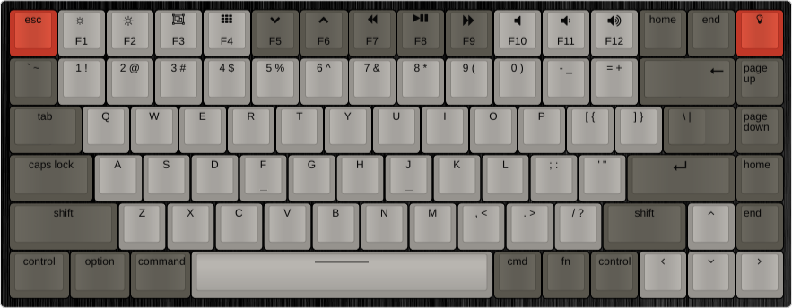
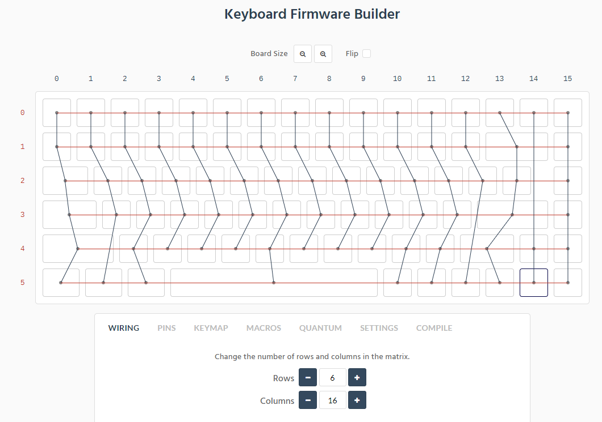

# Keychron K2 Reverse Engineering

This is partial and may or may not be completed.
Use this information at your own discretion and risk.

This is for K2 RGB v2.

## TODO List - QMK support
- [x] Ability to safely flash bootloader
- [x] Ability to revert to factory firmware
- [x] Confirm Chibios functionality
- [x] Get QMK Working
- [x] Get LEDs working
- [ ] Confirm bluetooth functionality

## Chips
* Main MCU - HFD2201KBA - appears to be based on/clone of [SONIX SN32F24xB](http://www.sonix.com.tw/article-tw-4315-30347)

* Bt module [CYPRESS CYW20730A2KFBG](https://www.infinite-electronic.ru/datasheet/2a-CYW20730A2KFBG.pdf)

* Charge IC - TPU5000

## Key Matrix & MCU
[Keyboard Layout ](http://www.keyboard-layout-editor.com/##@_backcolor=%23ffffff&name=Keychron%20K2%20v2&background_name=Aluminium%20brushed%20black&style=background-image%2F:%20url('%2F%2Fbg%2F%2Fmetal%2F%2Faluminum%2F_texture1644.jpg')%2F%3B%3B&switchMount=cherry&switchBrand=greetech&switchType=GT02A1Bxx%3B&@_c=%23c13828&p=OEM%20R4&a:5%3B&=esc&_c=%2396938e&fa@:5%3B%3B&=%3Ci%20class%2F='kb%20kb-Unicode-Screen-Dim'%3E%3C%2F%2Fi%3E%0AF1&=%3Ci%20class%2F='kb%20kb-Unicode-Screen-Bright'%3E%3C%2F%2Fi%3E%0AF2&_f:3%3B&=%3Ci%20class%2F='fa%20fa-object-group'%3E%3C%2F%2Fi%3E%0AF3&_f:3%3B&=%3Ci%20class%2F='fa%20fa-th'%3E%3C%2F%2Fi%3E%0AF4&_c=%2359564d&f:3%3B&=%3Ci%20class%2F='fa%20fa-chevron-down'%3E%3C%2F%2Fi%3E%0AF5&_f:3%3B&=%3Ci%20class%2F='fa%20fa-chevron-up'%3E%3C%2F%2Fi%3E%0AF6&_f:3%3B&=%3Ci%20class%2F='fa%20fa-backward'%3E%3C%2F%2Fi%3E%0AF7&_fa@:2%3B%3B&=%3Ci%20class%2F='fa%20fa-play'%3E%3C%2F%2Fi%3E%3Ci%20class%2F='fa%20fa-pause'%3E%3C%2F%2Fi%3E%0AF8&_fa@:4%3B%3B&=%3Ci%20class%2F='fa%20fa-forward'%3E%3C%2F%2Fi%3E%0AF9&_c=%2396938e&fa@:5%3B%3B&=%3Ci%20class%2F='fa%20fa-volume-off'%3E%3C%2F%2Fi%3E%0AF10&=%3Ci%20class%2F='fa%20fa-volume-down'%3E%3C%2F%2Fi%3E%0AF11&=%3Ci%20class%2F='fa%20fa-volume-up'%3E%3C%2F%2Fi%3E%0AF12&_c=%2359564d&f:3%3B&=home&_f:3%3B&=end&_c=%23c13828&f:3%3B&=%3Ci%20class%2F='fa%20fa-lightbulb-o'%3E%3C%2F%2Fi%3E%3B&@_c=%2359564d&f:3%3B&=%60%20~&_c=%2396938e&f:3%3B&=1%20!&_f:3%3B&=2%20%2F@&_f:3%3B&=3%20%23&_f:3%3B&=4%20$&_f:3%3B&=5%20%25&_f:3%3B&=6%20%5E&_f:3%3B&=7%20%2F&&_f:3%3B&=8%20*&_f:3%3B&=9%20(&_f:3%3B&=0%20)&_f:3%3B&=-%20%2F_&_f:3%3B&=%2F=%20+&_c=%2359564d&a:4&f:7&w:2&w2:1%3B&=%0A%0A%3Ci%20class%2F='kb%20kb-Arrows-Left'%3E%3C%2F%2Fi%3E&_f:3%3B&=page%0A%0A%0A%0A%0A%0Aup%3B&@_p=OEM%20R3&a:5&w:1.5&w2:1%3B&=tab&_c=%2396938e%3B&=Q&=W&=E&=R&=T&=Y&=U&=I&=O&=P&=%5B%20%7B&=%5D%20%7D&_c=%2359564d&w2:1.5%3B&=%5C%20%7C&_x:0.5&a:4%3B&=page%0A%0A%0A%0A%0A%0Adown%3B&@_p=OEM%20%20R2&a:5&w:1.75%3B&=caps%20lock&_c=%2396938e%3B&=A&=S&=D&_n:true%3B&=F&=G&=H&_n:true%3B&=J&=K&=L&=%2F%3B%20%2F:&='%20%22&_c=%2359564d&f:7&w:2.25%3B&=%3Ci%20class%2F='kb%20kb-Return-2'%3E%3C%2F%2Fi%3E&_a:4&f:3%3B&=home%3B&@_p=OEM%20R1&a:5&w:2.25%3B&=shift&_c=%2396938e%3B&=Z&=X&=C&=V&=B&=N&=M&=,%20%3C&=.%20%3E&=%2F%2F%20%3F&_c=%2359564d&w:1.75%3B&=shift&_c=%2396938e%3B&=%3Ci%20class%2F='fa%20fa-angle-up'%3E%3C%2F%2Fi%3E&_c=%2359564d&a:4%3B&=end%3B&@_a:5&w:1.25%3B&=control&_w:1.25%3B&=option&_w:1.25%3B&=command&_c=%2396938e&p=OEM%20SPACE&w:6.25%3B&=%2F&mdash%2F%3B%2F&mdash%2F%3B%2F&mdash%2F%3B%2F&mdash%2F%3B%2F&mdash%2F%3B&_c=%2359564d&p=OEM%20R1%3B&=cmd&=fn&=control&_c=%2396938e%3B&=%3Ci%20class%2F='fa%20fa-angle-left'%3E%3C%2F%2Fi%3E&=%3Ci%20class%2F='fa%20fa-angle-down'%3E%3C%2F%2Fi%3E&=%3Ci%20class%2F='fa%20fa-angle-right'%3E%3C%2F%2Fi%3E)

## MCU-Diagram - Keyboard matrix diagram on the MCU

| --- | col | C0 | C1 | C2 | C3 | C4 | C5 | C6 | C7 | C8 | C9 | C10 | C11 | C12 | C13 | C14 | C15 |
| --- | --- | -- | -- | -- | -- | -- | -- | -- | -- | -- | -- | --- | --- | --- | --- | --- | --- |
| row | pin | 25 | 26 | 27 | 28 | 29 | 30 | 31 | 32 | 34 | 35 | 36  | 37  | 38  | 39  | 40  | 41  |
| R0  | 64  |    |    |    |    |    |    |    |    |    |    |     |     |     |     |     |     |
| R1  | 63  |    |    |    |    |    |    |    |    |    |    |     |     |     |     |     |     |
| R2  | 62  |    |    |    |    |    |    |    |    |    |    |     |     |     |     |     |     |
| R3  | 61  |    |    |    |    |    |    |    |    |    |    |     |     |     |     |     |     |
| R4  | 60  |    |    |    |    |    |    |    |    |    |    |     |     |     |     |     |     |
| R5  | 59  |    |    |    |    |    |    |    |    |    |    |     |     |     |     |     |     |
## MCU-Diagram - LED matrix

|   g  |   b  |   r  |  --- |  --- |  --- | col | C0 | C1 | C2 | C3 | C4 | C5 | C6 | C7 | C8 | C9 | C10 | C11 | C12 | C13 | C14 | C15 |
|  --- |  --- |  --- |  --- |  --- |  --- | --- | -- | -- | -- | -- | -- | -- | -- | -- | -- | -- | --  | --  | --  | --  | --  | --  |
|  ch1 |  ch2 |  ch3 |  pin |  pin |  pin | pin | 25 | 26 | 27 | 28 | 29 | 30 | 31 | 32 | 34 | 35 | 36  | 37  | 38  | 39  | 40  | 41  |
|  Q13 |  Q7  |  Q1  |  01  |  02  |  04  | --- | -- | -- | -- | -- | -- | -- | -- | -- | -- | -- | --- | --- | --- | --- | --- | --- |
|  Q14 |  Q8  |  Q2  |  05  |  06  |  07  | --- | -- | -- | -- | -- | -- | -- | -- | -- | -- | -- | --- | --- | --- | --- | --- | --- |
|  Q15 |  Q9  |  Q3  |  08  |  09  |  10  | --- | -- | -- | -- | -- | -- | -- | -- | -- | -- | -- | --- | --- | --- | --- | --- | --- |
|  Q16 |  Q10 |  Q4  |  11  |  12  |  13  | --- | -- | -- | -- | -- | -- | -- | -- | -- | -- | -- | --- | --- | --- | --- | --- | --- |
|  Q17 |  Q11 |  Q5  |  14  |  15  |  47  | --- | -- | -- | -- | -- | -- | -- | -- | -- | -- | -- | --- | --- | --- | --- | --- | --- |
|  Q18 |  Q12 |  Q6  |  50  |  49  |  48  | --- | -- | -- | -- | -- | -- | -- | -- | -- | -- | -- | --- | --- | --- | --- | --- | --- |

## MCU-Diagram - mac/win and bt/off/cable dip switches

- Bluetooth / O / Cable Mode: pin 57
- Win - Android / Mac - iOS Mode: pin 51

## MCU-Diagram - Caps Lock indicator

- Caps Lock: pin 43

## MCU Pinout - SN32F248BF

## Bluetooth module

seems to be wired like the Blitzwolf BW-KB1(https://github.com/IslamAlam/blitzwolf-bw-kb-1)
